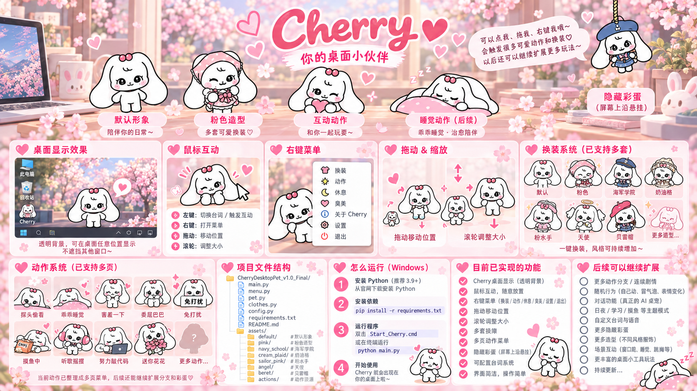

# 🍒 Cherry Desktop Pet

> 一个使用 **Python + PySide6** 制作的 Windows 可爱互动桌宠。  
> Cherry 可以陪你待在桌面上、换装、做动作、随机说话，还会根据当前状态触发连续动作和隐藏彩蛋。

## 🌸 Project Preview

<p align="center">
  
</p>


---

## ✨ 项目简介

**Cherry Desktop Pet** 是一个以 Cherry 为核心角色的 Windows 桌面宠物项目。

它不是单纯的“桌面图片”，而是一个带有 **交互、状态、换装、动作、随机台词和隐藏彩蛋** 的桌面小伙伴。

当前版本：**v1.0 FINAL**

---

## 🌸 已实现功能

### 🖱️ 桌面交互

- **左键点击 Cherry**：根据当前状态随机说一句台词，并有概率触发特殊反应
- **左键拖动 Cherry**：自由移动到桌面任意位置
- **鼠标滚轮**：调整 Cherry 大小
- **右键 Cherry**：打开主菜单
- 自动记住 Cherry 的：
  - 桌面位置
  - 当前大小
  - 当前换装
  - 当前主要动作

---

## 👗 换装系统

Cherry 目前支持多套造型，可以通过：

**右键 Cherry → 换装**

进入衣橱选择。

当前包含：

- 🤍 默认造型
- 🎀 粉色造型
- 🫐 蓝莓贝雷帽
- 💗 粉色水手服
- 🧁 奶油格纹
- ⚓ 海军学院
- 👼 爱心天使

衣橱支持分页浏览，并可以继续扩展更多服装。

---

## 🎭 动作系统

通过：

**右键 Cherry → 玩耍**

可以进入多页动作菜单。

当前已加入约 **20 个互动动作**，包括：

| 动作 | 示例 |
|---|---|
| 💗 抱爱心 | 给你一颗小爱心 |
| 👍 给你点赞 | 鼓励一下 |
| 😊 害羞一下 | 被盯着看会脸红 |
| 🥺 委屈巴巴 | 等你来哄 |
| 🤫 免打扰 | 安静模式 |
| 🐟 摸鱼中 | 偷偷休息 |
| 🪧 工作中 | 认真工作 |
| 💻 努力敲代码 | 疯狂抓 bug |
| 🥱 写困了 | 写代码写到没电 |
| 🎧 听歌摇摆 | 跟着音乐一起摇 |
| 🌬️ 吹吹小风 | 夏天降温 |
| 🥔 躺平吃薯片 | 摆烂五分钟 |
| 😗 傲娇一下 | 嘴硬一下 |
| 🍀 好运给你 | 四叶草 buff +1 |
| 💰 一夜暴富 | Cherry 的小金库爆满 |
| 🤍 歪头看你 | 偷偷观察你 |
| 👀 探头偷看 | 看看你在干嘛 |
| 🍫 巧克力时间 | 偷吃一点甜甜的 |
| 😠 生气了 | 需要你来哄 |
| 💐 送你花花 | 偷偷送一点浪漫 |

---

## 💬 随机台词与状态互动

Cherry 的动作不是只换一张图片。

每个状态都有自己的随机台词，例如：

```text
努力敲代码：
“Cherry 正在疯狂敲代码！”
“这个 bug 到底藏哪了…”
“马上就写完啦！”
“不许催！越催 bug 越多！”
```

当 Cherry 处于某个动作时继续点击她，还可能出现：

- 普通随机台词
- 当前状态专属台词
- 特殊二次回应
- 临时延伸动作
- 隐藏彩蛋

---

## 🔄 连续状态

部分动作之间存在自然的状态变化。

例如：

```text
努力敲代码
    ↓
写困了
    ↓
乖乖睡觉
```

以及：

```text
躺平吃薯片
    ↓
开始犯困
    ↓
短暂进入困困状态
```

这些变化会根据时间和当前状态自动触发，让 Cherry 更像一个真正“活着”的桌面宠物，而不是单纯的图片查看器。

---

## 🎁 隐藏彩蛋

### 🪢 摸鱼被抓包

当 Cherry 处于 **“摸鱼中”** 状态时：

- 连续快速点击 Cherry，有机会触发隐藏彩蛋
- Cherry 会变成“被抓包”的特殊造型
- 并跑到 **屏幕最上方悬挂起来**
- 点击她会出现：

```text
“可以把我放下来吗…”
“Cherry 被挂住啦！”
“呜…摸鱼被抓包了”
```

继续点击几次后，她会被“放下来”，回到原来的位置和状态。

长时间保持摸鱼状态时，也有概率自动触发这个彩蛋。

---

## 🌙 休息与臭美

主菜单还可以直接进入两个特殊状态：

### 🌙 休息

Cherry 会进入睡觉状态。

可能会说：

```text
“Cherry 要睡一小会儿啦～”
“Zzz…有点困了”
“再睡五分钟嘛…”
```

### 💎 臭美

Cherry 会拿起小镜子看看自己。

可能会说：

```text
“让我看看今天漂不漂亮～”
“嗯～今天也很可爱 ♡”
“等一下，Cherry 还没照完呢！”
```

---

## 🖥️ 系统要求

推荐环境：

- Windows 10 / Windows 11
- Python **3.9+**
- PySide6
- Pillow

---

## 🚀 安装与运行

### 方法一：使用项目自带脚本

1. 下载或 Clone 本项目
2. 第一次运行时双击：

```text
安装依赖.bat
```

3. 安装完成后双击：

```text
启动Cherry.bat
```

也可以运行：

```text
Start_Cherry.cmd
```

---

### 方法二：命令行运行

进入项目目录：

```bash
pip install -r requirements.txt
python main.py
```

依赖：

```text
PySide6>=6.7
Pillow>=10.0
```

---

## 🎮 操作说明

| 操作 | 功能 |
|---|---|
| 左键单击 Cherry | 随机台词 / 当前状态互动 |
| 左键拖动 | 移动 Cherry |
| 鼠标滚轮 | 调整 Cherry 大小 |
| 右键 Cherry | 打开功能菜单 |
| 右键 → 换装 | 打开衣橱 |
| 右键 → 玩耍 | 打开动作菜单 |
| 右键 → 休息 | 进入睡觉状态 |
| 右键 → 臭美 | 进入臭美状态 |

---

## 📁 项目结构

```text
CherryDesktopPet/
│
├─ main.py                 # Cherry 主程序与交互逻辑
├─ requirements.txt        # Python 依赖
├─ Start_Cherry.cmd        # 启动脚本
├─ 安装依赖.bat             # 一键安装依赖
├─ 启动Cherry.bat           # 一键启动
│
├─ assets/
│  ├─ default/             # 默认造型
│  ├─ pink/                # 粉色造型
│  ├─ beret/               # 蓝莓贝雷帽
│  ├─ sailor_pink/         # 粉色水手服
│  ├─ cream_plaid/         # 奶油格纹
│  ├─ navy_school/         # 海军学院
│  ├─ angel/               # 爱心天使
│  ├─ outfits/             # 衣橱预览素材
│  └─ actions/             # 动作与彩蛋素材
│
└─ README.md
```

---

## 🛠️ 技术实现

主要技术：

- **Python**
- **PySide6 / Qt**
- PNG Alpha 透明素材
- 无边框透明窗口
- Always-on-top 桌面窗口
- 鼠标事件处理
- QTimer 定时状态切换
- QSettings 保存设置
- 状态式交互逻辑
- 随机台词与彩蛋系统

在这个项目中可以学习到：

- GUI 桌面程序开发
- 事件驱动编程
- 状态管理 / 简单状态机
- 图片透明通道处理
- UI / UX 设计
- 软件调试与版本迭代

---

## 🗺️ 后续计划

未来可能继续加入：

- [ ] 更多 Cherry 动作和连续剧情
- [ ] 更多服装与主题造型
- [ ] 自动走动与更多自主行为
- [ ] 节日 / 学习 / 工作等桌面场景
- [ ] 更丰富的隐藏彩蛋
- [ ] 自定义台词系统
- [ ] 语音与音效
- [ ] 系统托盘
- [ ] 开机自启动
- [ ] AI 对话能力
- [ ] 更完整的角色记忆与长期互动

---

## 💡 项目故事

Cherry Desktop Pet 是一个从简单桌面图片逐渐迭代出来的小项目。

项目从最早的：

```text
显示一只 Cherry
```

逐渐加入：

```text
透明窗口
→ 鼠标拖动
→ 右键菜单
→ 换装
→ 多页动作
→ 随机台词
→ 状态切换
→ 连续动作
→ 隐藏彩蛋
```

这个项目也是一次完整的软件开发练习：从想法、UI、素材处理，到程序开发、Debug、版本迭代和最终发布。

---

## 🤝 Contributing

欢迎提出 Issue、改进建议和功能想法。

如果你希望增加新的：

- Cherry 动作
- 换装
- 台词
- 彩蛋
- UI
- 交互逻辑

都可以通过 Issue 或 Pull Request 参与。

---

## 📜 License & Artwork

项目代码与角色素材的授权范围可能不同。

**Cherry 的角色图片、插画和其他视觉素材不应默认视为与源代码采用相同的开源许可。**

在明确添加 LICENSE / 素材授权声明之前，请不要默认复制、重新发布或商业使用角色素材。

后续可为：

- 源代码
- 原创素材
- 第三方 / 参考素材

分别添加更清晰的授权说明。

---

## 💗 Cherry

> “Cherry 在这里呀～”  
> “今天也要开心一点哦 ♡”

如果你喜欢这个项目，欢迎 ⭐ Star！
